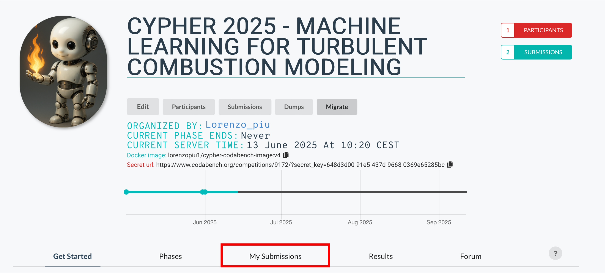
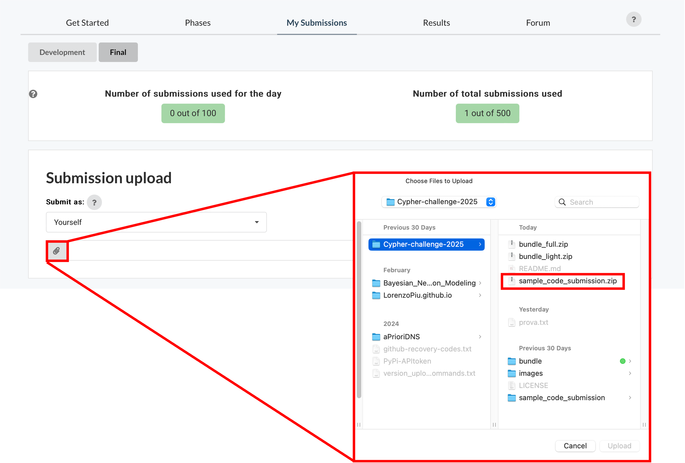
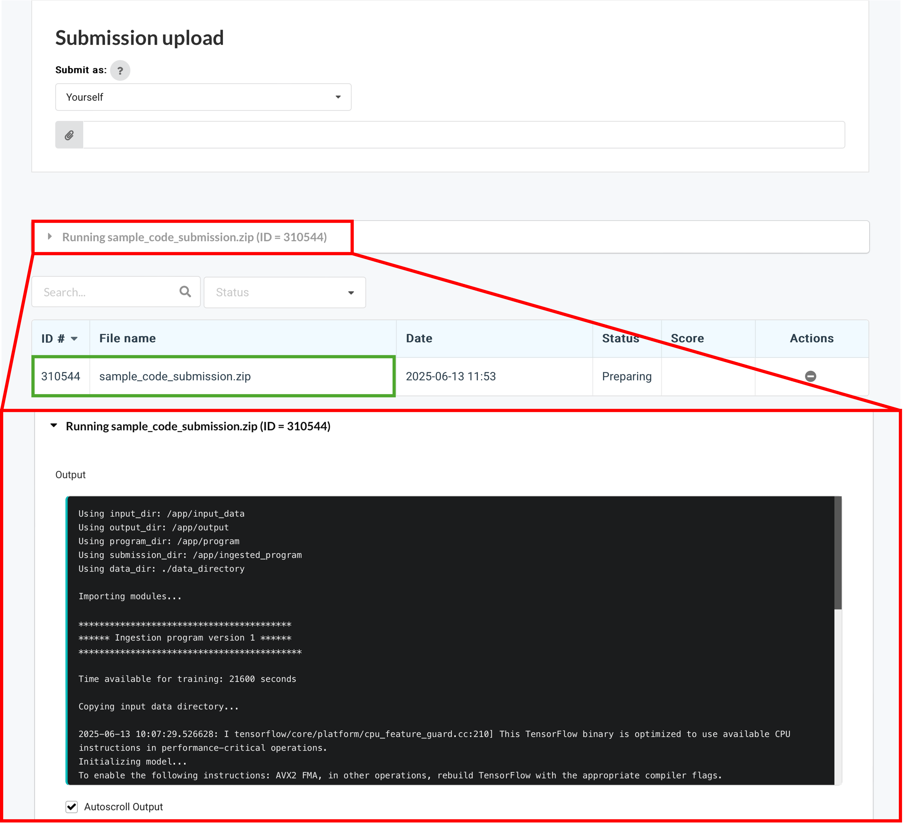
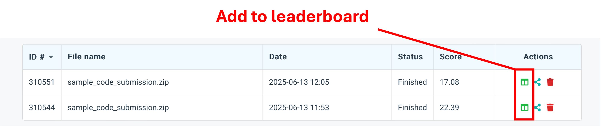
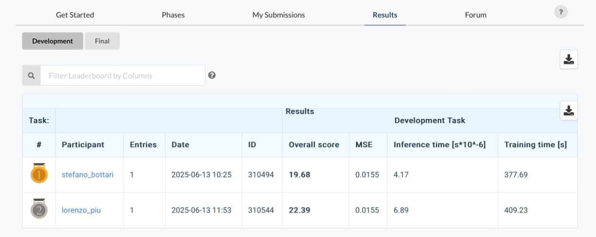

# Cypher-challenge-2025
Challenge on machine learning for turbulent combustion modeling organised within the context of the [CYPHER COST Action](https://cypher.ulb.be/)
<p align="center">
  
</p>

## Overview
Combustion systems play a vital role in transportation, energy production, and residential heating. Nonetheless, current combustion systems heavily rely on fossil fuels, whose burning process is now acknowledged as a source of greenhouse gases and consequently responsible for climate change.
While completely dismantling our reliance on combustion is unfeasible for the so-called 'hard-to-abate industries' [[1](https://doi.org/10.1016/j.resconrec.2024.107796 )], existing combustion processes can significantly reduce their CO2 emissions. In this context, the CYPHER COST action is dedicated to advancing the understanding of Renewable Synthetic Fuels (RSFs) combustion, high-fidelity simulations, hybrid physics-based data-driven models, and self-updating digital twins. 

Regarding combustion simulations, the Large eddy simulations (LES) stand as a powerful approach for studying turbulent combustion. LES directly resolves the large, energy-containing motions in the flow and filters out the smaller scales. Advances in high-performance computing and efficient algorithms have made this method increasingly accessible for practical use, but modeling the so-called sub-filter phenomena that arise at the unresolved smaller scales is still a challenging task, in particular for RSFs. While significant past efforts from the scientific community have developed physics-based methods to link sub-filter quantities to the resolved LES field, nowadays, approaches based on high-fidelity data are becoming popular. Within this framework, machine learning (ML) is an interesting tool in improving turbulent combustion closure models for LES. Typical ML algorithms, such as Neural Networks, can analyze large datasets from direct numerical simulations (DNS), which provide highly accurate representations of turbulence and chemistry interactions. Recent studies highlight the potential of machine learning algorithms to develop closure models that outperform traditional physics-based approaches. 

## Scope of the challenge
This challenge aims to establish a benchmark for model assessment in the context of machine learning (ML) applied to turbulent combustion modeling. This first effort to provide a standard dataset and evaluation metric can be leveraged to foster consistency, facilitate model comparison, and accelerate progress in developing robust, generalizable data-driven closure models for reactive flows. The public nature of the challenge, combined with its implementation on the Codabench https://doi.org/10.1016/j.patter.2022.100543 platform, ensures broad accessibility and promotes widespread dissemination within the research community.

Participants will be asked to submit a Python code that defines a machine learning model, which will be trained after submission with the available data. All the models submitted will be evaluated on out-of-sample data. Tests in this contest will only be performed _a priori_ on the DNS dataset. As future research perspectives aim at coupling these models with Computational Fluid Dynamics (CFD) codes for _a posteriori_ validation, we apply penalisation accounting for the model's inference time. 

All the technical information can be found at https://cypher.ulb.be/data-challenge/

## Submission guidelines
Participants can join the challenge through the following link: https://www.codabench.org/competitions/9172/
The link will lead to the following page:

<p align="center">
  
</p>

after clicking on the highlighted "My Submissions" section, you will be able to submit your model:

<p align="center">
  
</p>

an example file for submission is the 'sample_code_submission.zip' in the present GitHub folder. The [uncompressed folder](sample_code_submission) allows to explore the structure of the python code to be submitted. The only mandatory file that must be present at the moment of submission is the 'model.py' file. Every other kind of module is allowed in the submission folder, but additional data or pretrained models are not allowed in the present context. The organizers of the challenge reserve the right to check the submission files to verify those restrictions are respected.

The model.py script must define an object, named 'model', that will be read from the ingestion program. The object can leverage tensorflow, pytorch, or scikit_learn to inherit, based on the user's preferences. The object must have 3 fundamental methods, which will be called when the file is submitted:
- ```preprocess(self, data_folder):``` takes as input the relative path to the [training data folder](bundle/input_data/train) and process those data. The method must return an object (in the following referred to as D) that will be handled by the ```fit()``` method to train the model. The preprocessing can include every operation on the data in the folder that is useful to obtain better predictive capabilities (gradients computation, further filtering of the data for scale similarity models, etc...).
- ```fit(self, D):``` trains the model based on the processed data contained in the object D. The method does not return outputs, but can update the object attributes (e.g. the weights of the neural networks).
- ```predict(self, valid_data_folder):``` takes as input the relative path to the [validation data folder](bundle/input_data/valid/). **IMPORTANT**: the validation data folder path refers directly to the field containing folder, so the method does not have to explore the different conditions of equivalence ratios and filter sizes. The relative path is passed to this method in such a way that the field can be immediately read with the [aPriori](https://github.com/LorenzoPiu/aPrioriDNS) package  with one line of code:
  ```python
  import aPrioriDNS as ap
  field = ap.Field3D(valid_data_folder)
  ```
  Another trivial but important consideration regards the data scaling, which should be handled in the same way both during the training and testing process. The scaling parameters must not be updated during inference.
The present method must return the sub-filter turbulent diffusivity of the progress variable, alpha_t, that will be used to evaluate the model. More details on the model form can be found in the document on the [Cypher website](https://cypher.ulb.be/data-challenge/).

## After submission
After submitting the file, the platform will start processing the data. Loading the app may take a few minutes. After the backend is ready and the docker image is loaded, you should see an output similar to the one represented below. Successive submissions without refreshing the page should be faster than the initial one.

<p align="center">
  
</p>

The window in red will output the statements from the backend. The model submitted can contain print statements that will be shown as output, which can be useful for debugging purposes. After the ingestion and scoring programs are done, you can click on the green highlighted button to download the outputs of the training, and check the log files with the output and errors, if any.

When multiple submissions are presented, the best one (lower scoring) can manually be selected to be added to the leaderboard:
<p align="center">
  
</p>

After being added to the leaderboard, the scoring should be visible in the results section:
<p align="center">
  
</p>


## Organizing committee

<p align="center">
  
</p>


